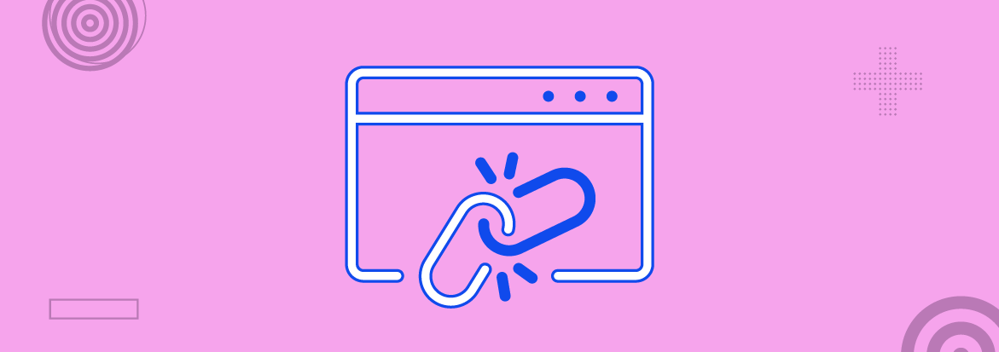

## Broken Link Hijacking

**Summary**

Broken Link Hijacking (BLH) is a web-based attack where it exploits external links that are no longer valid. The attackers take over this expired, stale, and invalid external links on credible websites or web applications for malicious or fraudulent purposes.

If your company uses an external link shortening service, for example, to include short links in tweets, it may be possible that the link shortener goes out of business after some time and is no longer valid. This means that all your old links are now broken. If your website has social media handles link in your website and it's broken, Attacker can exploit the link by creating a new account on that social media with the same username which had gone broken which hereby redirecting the victims to attacker's account. 

If an attacker purchases the domain used by the link shortening service that went out of business, they can substitute your original content with their own malicious content. 

Broken Link Hijacking is a P4 bug (Low Risk)

**How to Find**

1. Manually, Find and click external links on the target site ( For Example:- Some Links to Social Media Accounts or Some external Media Link)

2. 2. While Doing Manual work also put [broken-link-checker](https://github.com/stevenvachon/broken-link-checker) in background using below Command interminal.

    `blc -rof --filter-level 3 https://example.com/`
    
   Ouput will be like Something. 
   
   `─BROKEN─ https://www.linkedin.com/company/company-name/ (HTTP_999)`
   
 3. Now you need to check if company has the page or not , if no then register as the company or try to get that username or url. 

 or 

 1. Go to [Online Broken Link Checker](https://ahrefs.com/broken-link-checker), [Dead Link Checker](https://www.deadlinkchecker.com/) Or [Alternative Online Broken Link Checker](https://brokenlinkcheck.com/)
 2. Input the domain name

 